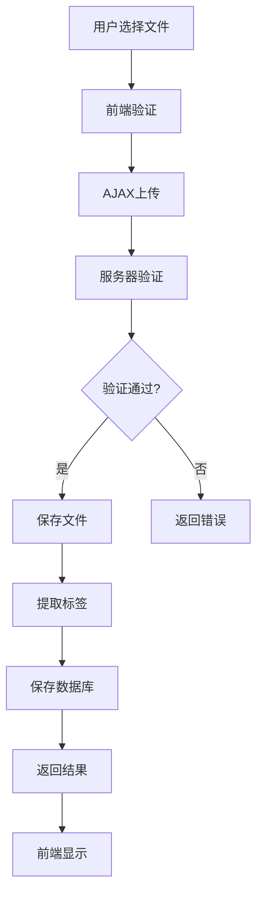
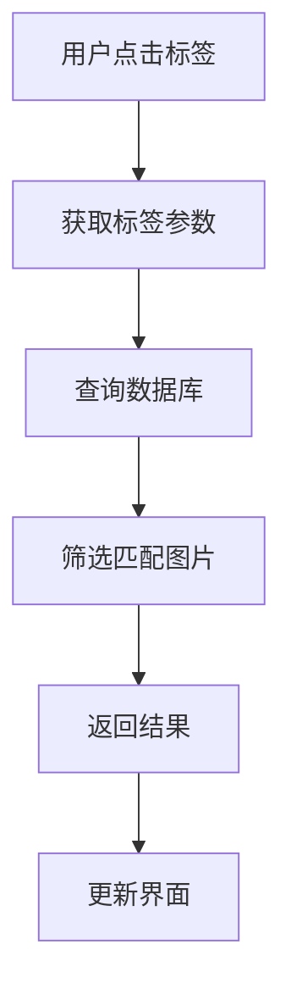

# 技术架构文档

## 系统架构概览

PicHost系统采用经典的三层架构设计：

```
前端界面层 (Presentation Layer)
    ↓
业务逻辑层 (Business Logic Layer)  
    ↓
数据访问层 (Data Access Layer)
```

## 🏗️ 架构设计

### 前端架构

#### 技术选型
- **Bootstrap 5** - 响应式UI框架
- **自定义CSS** - 现代化视觉效果
- **原生JavaScript** - 交互功能实现
- **Font Awesome** - 图标库

#### 组件设计

**首页组件** (`index.php`)
- 导航栏组件
- 上传区域组件
- 图片展示组件
- 响应式布局组件

**后台管理组件** (`admin.php`)
- 登录认证组件
- 图片管理组件
- 标签筛选组件
- 系统设置组件

### 后端架构

#### 核心模块

**1. 路由模块**
- 基于文件的路由系统
- RESTful API设计风格
- 统一的请求处理

**2. 数据库模块** (`config/database.php`)
- PDO数据库连接
- 连接池管理
- 错误处理机制

**3. 功能模块** (`includes/functions.php`)
- 图片处理函数
- 文件上传验证
- 标签提取逻辑
- GitHub API集成

**4. 配置模块** (`config/config.php`)
- 环境配置管理
- 常量定义
- 安全设置

#### 数据流设计

```
用户请求 → 路由分发 → 业务处理 → 数据操作 → 响应返回
```

## 🗄️ 数据库设计

### 数据表结构

#### images表（图片信息表）
```sql
CREATE TABLE images (
    id INT AUTO_INCREMENT PRIMARY KEY,
    filename VARCHAR(255) NOT NULL,        -- 存储文件名
    original_name VARCHAR(255) NOT NULL,   -- 原始文件名
    tags TEXT,                            -- 标签列表（逗号分隔）
    file_size INT,                        -- 文件大小（字节）
    mime_type VARCHAR(100),               -- MIME类型
    github_url VARCHAR(500),              -- GitHub存储URL
    local_path VARCHAR(500),              -- 本地存储路径
    storage_type ENUM('local', 'github'), -- 存储类型
    upload_time TIMESTAMP DEFAULT CURRENT_TIMESTAMP
);
```

### 数据关系

```
images
├── 存储类型 (storage_type)
│   ├── local → local_path
│   └── github → github_url
├── 标签系统 (tags)
└── 时间索引 (upload_time)
```

## 🔄 核心流程

### 图片上传流程



### 标签筛选流程



## 🎨 界面设计架构

### CSS架构原则

**1. 响应式设计**
- 移动优先的设计理念
- 断点：xs(<576px), sm(≥576px), md(≥768px), lg(≥992px), xl(≥1200px)

**2. 视觉层次**
- 渐变背景设计
- 玻璃拟态效果
- 阴影和圆角
- 动画过渡效果

**3. 组件化样式**
```css
/* 组件类命名规范 */
.component-name {
    /* 基础样式 */
}

.component-name--modifier {
    /* 修饰样式 */
}

.component-name__element {
    /* 元素样式 */
}
```

### JavaScript架构

**模块化设计**
```javascript
// 上传模块
const UploadManager = {
    init: function() {},
    validateFile: function() {},
    uploadFile: function() {}
};

// 标签模块
const TagManager = {
    init: function() {},
    filterByTag: function() {},
    updateUI: function() {}
};
```

## 🔧 配置管理

### 配置文件结构

**config/config.php** - 主要配置
```php
// 数据库配置
define('DB_HOST', 'localhost');
// ... 其他配置
```

**config/settings.json** - 动态配置
```json
{
    "require_login": false,
    "github_repo_owner": "",
    "github_repo_name": ""
}
```

### 环境配置

**开发环境**
- 错误显示开启
- 调试模式启用
- 本地数据库连接

**生产环境**
- 错误日志记录
- 性能优化配置
- 安全设置启用

## 🚀 性能优化策略

### 前端优化
- 资源压缩和合并
- 图片懒加载
- 缓存策略优化
- CDN资源利用

### 后端优化
- 数据库索引优化
- 查询缓存机制
- 文件缓存策略
- 代码压缩处理

### 存储优化
- 图片压缩处理
- 存储路径优化
- 缓存机制实现

## 🔒 安全架构

### 输入验证
- 文件类型验证
- 文件大小限制
- XSS防护措施
- SQL注入防护

### 权限控制
- 会话管理
- 管理员认证
- 文件访问控制
- API权限验证

### 数据安全
- 数据库加密
- 文件权限设置
- 备份策略
- 日志记录

## 📊 监控和日志

### 日志系统
- 操作日志记录
- 错误日志追踪
- 性能监控日志
- 安全事件日志

### 监控指标
- 上传成功率
- 系统响应时间
- 存储空间使用
- 用户访问统计

## 🔄 扩展性设计

### 插件架构
- 存储后端插件化
- 标签提取插件
- 界面主题插件
- 功能模块插件

### API设计
- RESTful API接口
- 统一的响应格式
- 版本控制支持
- 文档自动生成

## 🛠️ 开发规范

### 代码规范
- PSR标准遵循
- 命名规范统一
- 注释文档完善
- 代码审查流程

### 版本控制
- Git分支管理
- 提交信息规范
- 发布流程定义
- 变更日志维护

---

**架构版本**: v1.0  
**最后更新**: 2025-12-27  
**维护者**: 项目团队